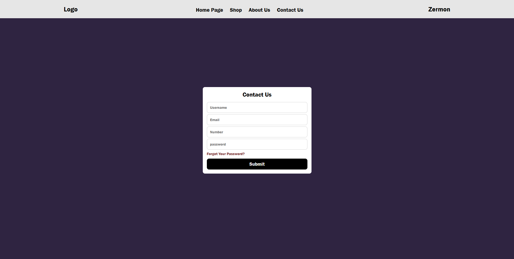

# 🌟 Modern-Login-Form

---

## 🇮🇷 توضیحات فارسی

فرم لاگین **مدرن، مینیمال و واکنش‌گرا** ساخته‌شده با **HTML** و **CSS**.  
این پروژه نمونه‌ای ساده و زیبا از صفحه ورود به سیستم است و برای تمرین طراحی رابط کاربری (UI) و یادگیری CSS عالیست.  
می‌توانید از آن در پروژه‌های شخصی، تمرینی یا وب‌سایت‌های واقعی استفاده کنید.

### 🎯 ویژگی‌ها
- ✨ طراحی مدرن و مینیمال  
- 📱 واکنش‌گرا (نمایش صحیح در موبایل و دسکتاپ)  
- 🎨 افکت‌های نرم روی فیلدها و دکمه‌ها  
- 🧩 کد تمیز و قابل ویرایش برای یادگیری و توسعه  

### 🖥️ نحوه استفاده
1. پروژه را دانلود یا کلون کنید  
2. فایل `index.html` را با مرورگر باز کنید  
3. برای تغییر رنگ‌ها، فونت‌ها یا افکت‌ها، فایل `style.css` را ویرایش کنید  

### 🚀 پیش‌نمایش آنلاین
اگر GitHub Pages فعال باشد:  
[مشاهده آنلاین پروژه]([https://MohammadHossen-Tajrishi.github.io/Modern-Login-Form/](https://mohammadhossein-tajrishi.github.io/Modern-Login-Form/))  

---

## English Description

A **modern, minimal, and responsive** login form built with **HTML** and **CSS**.  
This project is a clean and simple example of a login page, perfect for practicing front-end UI design and CSS skills.  
It can be used for personal projects, learning purposes, or as a base template for real websites.

### 🎯 Features
- ✨ Modern and minimal UI design  
- 📱 Fully responsive layout for mobile and desktop  
- 🎨 Smooth hover and focus effects  
- 🧩 Clean and editable code — easy to learn and expand  

### 🖥️ How to Use
1. Download or clone the repository  
2. Open `index.html` in your browser  
3. Edit `style.css` to customize colors, fonts, or effects  

### 🚀 Live Preview
If GitHub Pages is enabled:  
[View Online Project](https://MohammadHossen-Tajrishi.github.io/Modern-Login-Form/)  

---

## 📄 License | لایسنس
This project is licensed under the **MIT License** — feel free to use, modify, and share.  
این پروژه تحت مجوز **MIT** منتشر شده — آزادید استفاده، تغییر یا بازنشر کنید.
